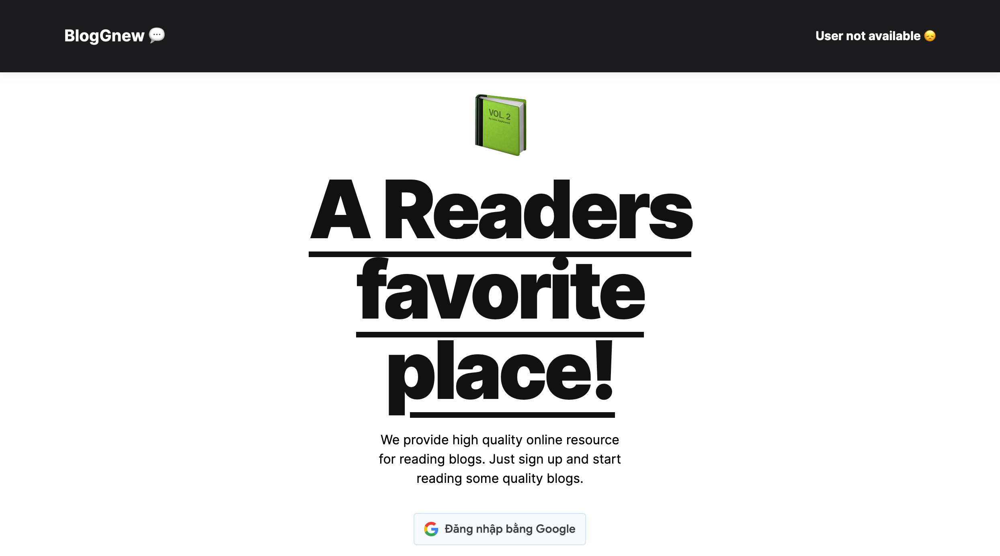
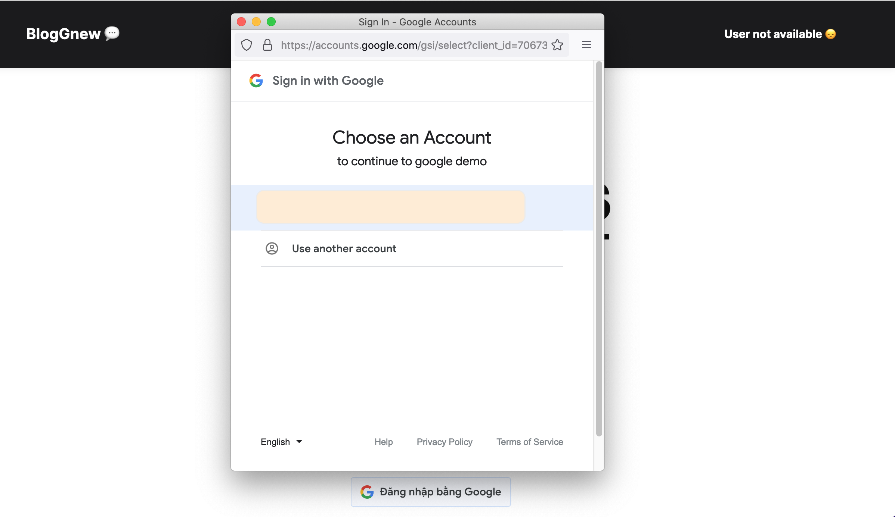

# Blog with API from GNews

# Review

**Home**

---

**Login with Google**

---

**Blog**

# Build width

- [Gnews API](https://gnews.io/)
- [React OAuth2 | Google](https://www.npmjs.com/package/@react-oauth/google)
- [Google Identity](https://developers.google.com/identity/gsi/web/guides/display-google-one-tap)
- [Google cloud - Credentials Oauth ID](https://console.cloud.google.com)
- [jwt-decode](https://www.npmjs.com/package/jwt-decode)
- [readux/toolkit](https://redux.js.org/introduction/installation)
